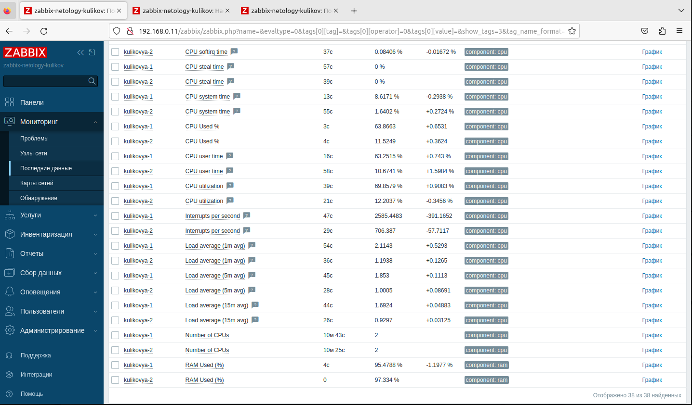

# Домашнее задание к занятию "`Система мониторинга Zabbix. Часть 2`" - `Куликов Юрий`

### Задание 1

Шаблон Zabbix "Zadanie 1"

### Задание 2

Решение в задании 3.

### Задание 3
Решение задачи 2-3
Страница хостов с привязкой шаблонов "Zadanie 1", "Linux by Zabbix Agent":

Сбор метрик с двух шаблонов:

### Задание 4

Кастомный dashboard "Zadanie 4":
